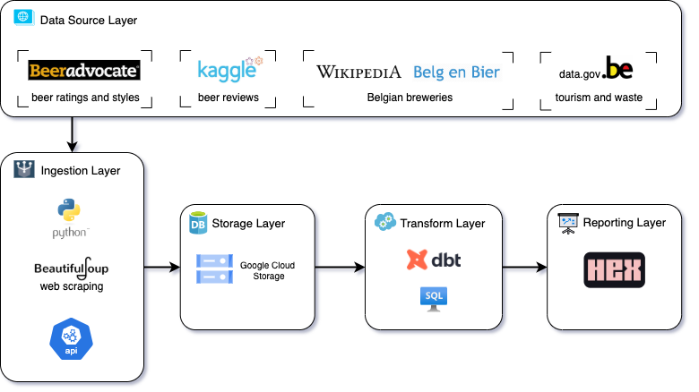
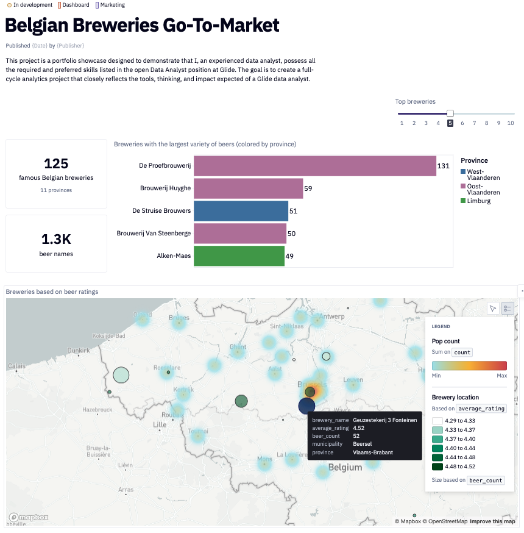

# 🍻 Belgian Beers and Breweries Go-To-Market

**Running go‑to‑market pipeline using scraped + structured beer industry data.  
Built for showcasing data analysis skills in Python → BigQuery → dbt → Hex → Actionable Insights.**

---

## 🎯 Project Overview

Sourcing Belgian beer data to identify potential partnership regions, high-quality breweries, and strategic recommendations—just like Glide would segment users or target expansion regions.

---

## 📁 Architecture Diagram



---

## 🚦 Data Sources

- **BeerAdvocate**: ratings, styles, brewery names, ABV
- **Kaggle – Beers & Reviews**: clean dataset of beer reviews
- **Belgenbier / Wikipedia**: list of 500+ Belgian breweries with province and 2000+ beers
- **Data.gov.be CKAN API**: optional enrichment using tourism or waste data

---

## 📊 Hex Dashboard

The Hex dashboard provides an interactive interface for users to explore the brewery data, filter by breweries with the largest variety of beers, and gain insights into potential partnerships.



---

## 🧪 Project Structure

```bash
belgian-brewery/
├── README.md
├── architecture_diagram.png
├── bebrew/
│   ├── models/
│   │   ├── staging/
│   │   │   ├── webscrape/
│   │   │   │   ├── _webscrape__models.yml
│   │   │   │   └── ...
│   │   └── ...
├── data/
│   ├── kaggle_beer_reviews.csv
│   ├── belgenbier.csv
│   ├── wikipedia_breweries.csv
│   └── beeradvocate_ratings.csv
├── src/
│   ├── __init__.py
│   ├── ingest/
│   │   ├── __init__.py
│   │   ├── beeradvocatescraper.py
│   │   ├── belgenbierscraper.py
│   │   └── kagglescraper.py
│   ├── transform/
│   │   ├── __init__.py
│   │   ├── bigquery_loader.py
│   │   ├── geodata_catcher.py
│   │   ├── llm_geocoder.py
│   │   └── wiki_brewery_cleaner.py
│   └── util/
│       ├── __init__.py
│       └── ...
├── notebook/
├── dashboard/
├── requirements.txt
├── .gitignore
├── .env
└── LICENSE
```

---

## ⚙️ Run the Pipeline

Quick start:

```bash
git clone https://github.com/sam0per/belgian-brewery.git
cd belgian-brewery
python3 -m venv venv
source venv/bin/activate
pip install -r requirements.txt

# Start data ingestion:
python src/ingest/beeradvocatescraper.py
python src/ingest/belgenbierscraper.py
python src/ingest/kagglescraper.py

# Add geolocation data:
python src/transform/geodata_catcher.py
python src/transform/llm_geocoder.py
python src/transform/wiki_brewery_cleaner.py

# Load data into BigQuery:
python src/transform/bigquery_loader.py

# Run transformations in dbt:
cd bebrew
dbt run
dbt test

# Generate dbt documentation:
dbt docs generate
dbt docs serve
```